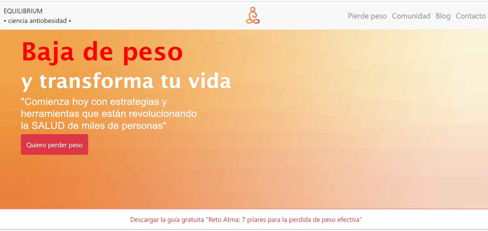

# Equilibrium

> Made entirely with HTML/CSS as the front end of Equilibrium's landing page.

## Built With

- HTML
- CSS

## Live Demo

[Live Demo Link](https://karmaester.github.io/Equilibrium/)

## Author

👤 **karmaester**

- Github: [@githubhandle](https://github.com/karmaester)
- Twitter: [@twitterhandle](https://twitter.com/karmaendlich)
- Linkedin: [linkedin](https://www.linkedin.com/in/khristian-rojas/)

## 🤝 Contributing

Contributions, issues and feature requests are welcome!

Feel free to check the [issues page](https://github.com/karmaester/Equilibrium/issues).

## Show your support

Give a ⭐️ if you like this project!

## Acknowledgments

- Inspired on older versions on modern layouts for landing pages with blog, contact and service request sections.

## 📝 License

This project is [MIT](lic.url) licensed.
